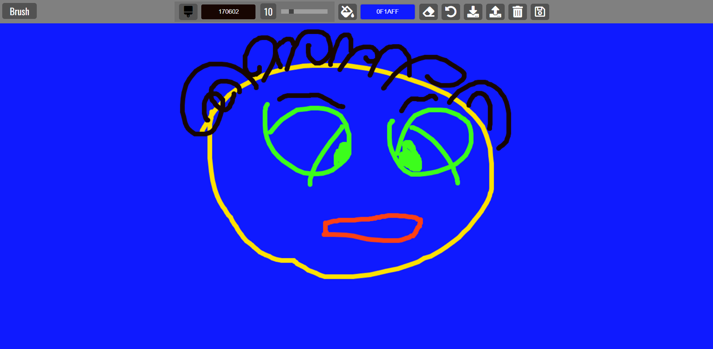

# paint_clone

## Description

This proejct uses the canvas api to allow a user to create their own works of art. The user can pick background color and brush colors and different brush sizes from the tool bar at the top of the screen. A user can save their picture to local storage and restore it at a later date. The user can delete the image from local storage if they wish. A clear canvas button allows a user to clear the entire screen and start again. The eraser button allows the user to delete a mistake on the page. The project also has a download button that allows the user to download their picture as a jpg.

## Demo

A demo of the project can be viewed here: https://tod619.github.io/paint_clone/
